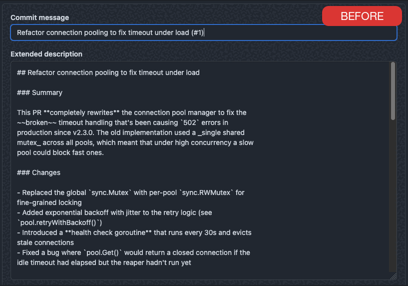
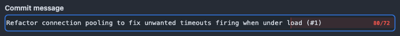
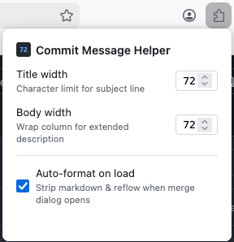

# GitHub PR Commit Message Toolbox

A Firefox extension that enforces good commit message discipline in GitHub's PR merge dialogs through sane defaults and additional tools.

When you merge a PR on GitHub, the commit message is typically pre-filled with the PR description – which means it contains markdown headings, bold text, image tags, URLs, and long lines. It is difficult to edit the description in situ because there is no indication of line width.

This extension strips the formatting and reflows the text to a configurable column width. It also provides a toolbar to enable manual reflowing of the text later after editing; no more copy-pasting into your editor to get well-formatted commit messages! 🎉



## What it does

- **Monospace font** – Switches the commit title and body fields to a monospace font so you can see exactly how the message will look in the terminal.
- **Column ruler and overflow highlighting** – Draws a vertical guide at the configured column width (default 72) and highlights text that exceeds it in red, for both the title and body fields.
  
- **Title character counter** – Shows a live `N/72` counter in the title field that turns red when you go over the limit.
- **Auto-format on load** – When the merge dialog opens, the extension strips markdown formatting (headings, bold, italic, links, images, fenced code blocks, HTML tags) and reflows the text to the configured column width. Fenced code blocks are converted to 4-space indented blocks so they survive the reflow untouched.
- **Manual reflow** – A toolbar below the body field lets you reflow text on demand. The reflow algorithm tries to achieve a similar output to `gq` in Vim/Neovim: it preserves paragraph breaks, list item structure with hanging indents, indented code blocks, and git trailers (`Co-authored-by`, `Signed-off-by`, etc.).
- **Undo** – Auto-formatting can be reverted with a single click. Manual reflows use `execCommand` under the hood, so Ctrl/Cmd+Z works natively.

## Settings

Click the extension icon to configure:



| Setting | Default | Description |
|---|---|---|
| Title width | 72 | Character guide limit for the subject line |
| Body width | 72 | Wrap column guide limit for the extended description |
| Auto-format on load | On | Strip markdown and reflow when the merge dialog opens |

## Install

Install from [addons.mozilla.org](https://addons.mozilla.org), or run from source with `yarn start`.

## Development

```sh
yarn test       # run tests
yarn build      # package .zip for AMO
yarn lint       # validate manifest and sources
```

## Licence

[MPL-2.0](LICENSE)
